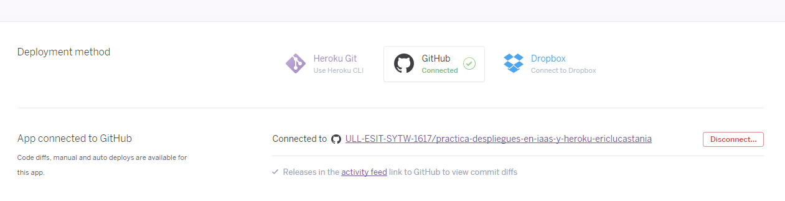

## Desplegando una aplicación en Heroku e iaas


# Descripción

Automatizar la subida de ficheros al iaas y heroku cada vez que se haga un push al repo.

## Como hacer un Fork del repositorio

#### Para desplegar en tu máquina en el iaas 

Info: El repo hace un pull de la práctica en github, por lo que la deberás tener previamente clonada

* Ve a la carpeta Scripts
* Abre el archivo ssh
* En el archivo pon tu ip en lugar de la que aparece
* Cambia la ruta del cd introduciendo la tuya, donde se encuentre el repo.

Una vez realizado estos pasos y previamente clonado el repositorio en el que quieras trabajar para que se sincronize con el iaas

Pasos a seguir:

### En la maquina iaas

* Clonar repositorio de github al iass 

    ```bash
        ssh usario@ip
    ```    
    Ruta de cd donde quieras clonar tu repositorio
    Clonar repositorio de github a iaas: ```git clone repositorio```

#### En local
    
Una vez realizado los anteriores pasos podemos trabajar en local realizando los correspondientes cambios que sean necesarios
en su repo,cuando hallas terminado guarda los cambios
    ```
       git add .
       git commit -m "guardando cambios antes de subir al iaas"
       git push
     ```
       
Si se realiza todo correctamente solo nos queda actualizar el iaas desde nuestra maquina local
    ```
     gulp iaas
     ```

     

    
    
### Desplegar el libro en heroku

Nuestra práctica está directamente sincronizada con los WebHooks de Heroku. Se sincroniza automáticamente
pero si deseas que tu práctica esté sincronizada con tu repositorio de Heroku deberás 
sincronizarla siguiendo estos pasos:

* Ve a tu repositorio de Heroku
* Abre la pestaña settings
* Busca la pestaña Deploys
* Escoge Deploys mediante github
* Añade la url del repositorio de la organización



* Activa el apartado sincronización automática


Una vez terminado, en tu repositorio de Github, dentro de settings y en el apartado Webhooks. Tendrás
algo así.


## Enlaces interesantes 
 
* [Repositorio de la práctica](https://github.com/ULL-ESIT-SYTW-1617/practica-despliegues-en-iaas-y-heroku-ericlucastania).
* [Descripción de la práctica.](https://crguezl.github.io/ull-esit-1617/practicas/practicaiaas.html)
* [Enlace a Gitbook](https://www.gitbook.com/book/alu0100785265/gitbook-let/details)
* [Enlace a Heroku](https://practica-heroku-iaas.herokuapp.com/)
* [Enlace al Iaas](http://10.6.128.159:8080/)

## Componentes del grupo de trabajo

* [Eric Ramos](https://github.com/alu0100786330)
* [Lucas Ruiz](https://github.com/alu0100785265)
* [Tania González](https://github.com/tania77)


